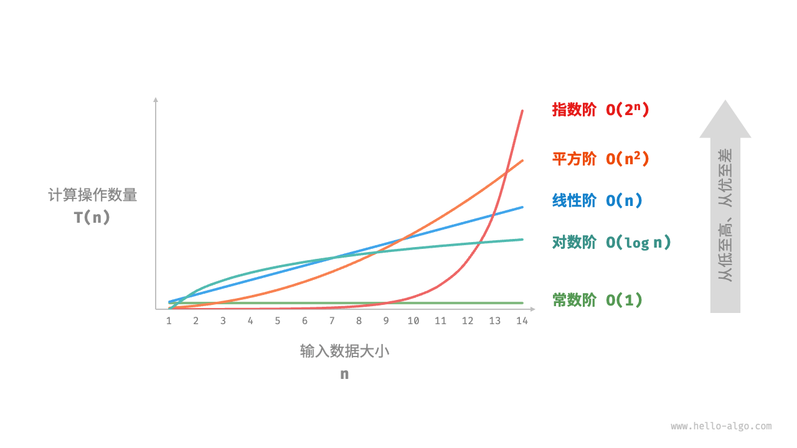

# 第2章 复杂度分析
## 2.2 迭代与递归
* 2.2.1 迭代
  * for循环
  * while循环: 自由度比for循环高
  * 嵌套循环
* 2.2.2 递归
  * 普通递归
    ```python
    def recur(n: int) -> int:
        """递归"""
        # 终止条件
        if n == 1:
            return 1
        # 递：递归调用
        res = recur(n - 1)
        # 归：返回结果
        return n + res
    ```
  * 尾递归 tail recursion: 在返回前的最后一步才进行递归调用. Python默认不支持尾递归优化, 可能会遇到栈溢出问题
    ```python
    def tail_recur(n, res):
        """尾递归"""
        # 终止条件
        if n == 0:
            return res
        # 尾递归调用
        return tail_recur(n - 1, res + n)
    ```
  * 递归树 recursion tree
    * 斐波那契数列: 一个调用产生两个调用分支
      ```python
      def fib(n: int) -> int:
          """斐波那契数列：递归"""
          # 终止条件 f(1) = 0, f(2) = 1
          if n == 1 or n == 2:
              return n - 1
          # 递归调用 f(n) = f(n-1) + f(n-2)
          res = fib(n - 1) + fib(n - 2)
          # 返回结果 f(n)
          return res
      ```
* 2.2.3 迭代与递归的对比
<p align="center"> 表 <id> &nbsp; 迭代与递归特点对比 </p>

|          | 迭代                                   | 递归                                                         |
| -------- | -------------------------------------- | ------------------------------------------------------------ |
| 实现方式 | 循环结构                               | 函数调用自身                                                 |
| 时间效率 | 效率通常较高，无函数调用开销           | 每次函数调用都会产生开销                                     |
| 内存使用 | 通常使用固定大小的内存空间             | 累积函数调用可能使用大量的栈帧空间                          |
| 适用问题 | 适用于简单循环任务，代码直观、可读性好 | 适用于子问题分解，如树、图、分治、回溯等，代码结构简洁、清晰 |

## 2.3 时间复杂度
* 2.3.1 统计时间增长趋势
  * 时间复杂度能评估算法效率, 且推算方法更简便. 但不一定代表算法效率, 无法等同于实际运行时间
* 2.3.2 函数渐近上界
  * 时间复杂度$O(n)$表示函数$T(n)$的渐近上界
* 2.3.3 推算方法
  * 第1步: 统计操作数量的简化技巧: 忽略常数项, 省略系数, 用乘法统计循环嵌套
  * 第2步: 判断渐近上界, $O(n)$由$T(n)$中最高项决定
* 2.3.4 常见类型
  * 时间复杂度: $𝑂(1) < 𝑂(log 𝑛) < 𝑂(𝑛) < 𝑂(𝑛 log 𝑛) < 𝑂(𝑛^2) < 𝑂(2𝑛) < 𝑂(𝑛!)$

    
* 2.3.5 最差、最佳、平均时间复杂度
  * 最差时间复杂度$O$
  * 最佳时间复杂度$\Omega$
  * 平均时间复杂度$\Theta$

## 2.4 空间复杂度
* 2.4.1 算法相关空间
  * 内存空间包括: 输入空间, 暂存空间 (暂存数据, 栈帧空间, 指令空间), 输出空间
* 2.4.2 推算方法
  * 只关注最差空间复杂度: 以最差输入数据为准, 以算法运行中的峰值内存为准
* 2.4.3 常见类型
  * 空间复杂度: $𝑂(1) < 𝑂(log 𝑛) < 𝑂(𝑛) < 𝑂(𝑛^2) < 𝑂(2^𝑛)$
* 2.4.4 权衡时间与空间
  * 降低时间复杂度通常需要以提升空间复杂度为代价, 反之亦然
